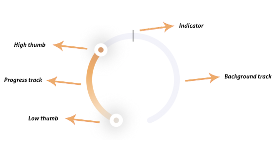

**Radial Gauge** is a custom UI component that consists of five layers. First, let’s break down the Radial Gauge in all of these five layers:

1. High thumb layer - Used for sliding and changing value.
2. Low thumb layer - Used for sliding and changing value.
3. Indicator layer - Used for showing the current value (for example current temperature).
4. Progress track layer - Layer which will follow current value on both sides.
5. Background track layer - Static layer below the progress layer.      



## Example

To run the example project, clone the repo, and run `pod install` from the Example directory first.


## Installation

RadialGauge is available through [CocoaPods](https://cocoapods.org). To install
it, simply add the following line to your Podfile:
```

pod "RadialGauge"

```

## Radial Gauge types
Radial Gauge can be configured as: 

1. single-mode, 
2. dual-mode or 
3. as a circular progress bar

**Single-mode**

Single-mode is a Radial Gauge with one thumb to control the slider.


**Dual-mode**
Dual-mode is a Radial Gauge with two thumbs to control the slider.


**Circular progress bar**
Circular progress bar is a Radial Gauge without thumbs. This can be useful for showing progress without user interaction.


## Usage
These properties can be configured to update UI:

1. Progress track layer color or gradient, 
2. Background track layer color,
3. Indicator and thumb color,
4. Indicator, thumb and track width

```

let radialGauge = RadialGauge()

// Set background color 
radialGauge.progressLayerColor = .red
radialGauge.backgroundTrackColor = .grey
radialGauge.highThumbColor = .white
radialGauge.lowThumbColor = .white
radialGauge.indicatorColor = .black

// Set gradient
radialGauge.gradientColors = viewModel.progressLayerGradient

// Set width
radialGauge.lineWidth = 15
radialGauge.highThumbLineWidth = 10
radialGauge.lowThumbLineWidth = 10
radialGauge.indicatorLineWidth = 10

//Set length
radialGauge.highThumbLength = 24
radialGauge.lowThumbLength = 24
radialGauge.indicatorLength = 24

```

Handle values

For dual-mode few properties can be configured to Radial Gauge work properly:
1. Low thumb minimum and maximum value
2. High thumb minimum and maximum value
3. Step size - Determines for how much will thumb change its value
4. Deadband - Maximum distance between two thumbs

Radial Gauge follows these rules:
1. One thumb cannot overlap another thumb.
2. The low thumb will be shown only between its minimum and maximum value
3. The high thumb will be shown only between its minimum and maximum value
4. The maximum value of the radial gauge will be a greater maximum value of both thumbs
5. The minimum value of the radial gauge will be a smaller minimum value of both thumbs

As mentioned above one thumb cannot overlap another thumb. To prevent this, Radial Gauge has deadband property. This property defines the maximum distance between two thumbs. If this distance is reached then one thumb pushes another thumb. This can be disabled using enableDualMovement() function call.

```
// Set low thumb
radialGauge.setLowThumbMaximumValue(50)
radialGauge.setLowThumbMinimumValue(0)
radialGauge.setLowThumbStepSize(1)


// Set high thumb
radialGauge.setHighThumbMaximumValue(100)
radialGauge.setHighThumbMinimumValue(0)
radialGauge.setHighThumbStepSize(1)

radialGauge.enableDualMovement(false)
radialGauge.setThumbStepSize(1)
radialGauge.setDeadband(1)

```

We can set a value for thumbs and the indicator.

```

// Set value for thumbs
radialGauge.handleThumbValue(value: 20, thumbType: .lowThumb)
radialGauge.handleThumbValue(value: 50, thumbType: .highThumb)

// Set value for indicator
radialGauge.setIndicatorValue(50)

```


## License

RadialGauge is available under the MIT license. See the LICENSE file for more info.
